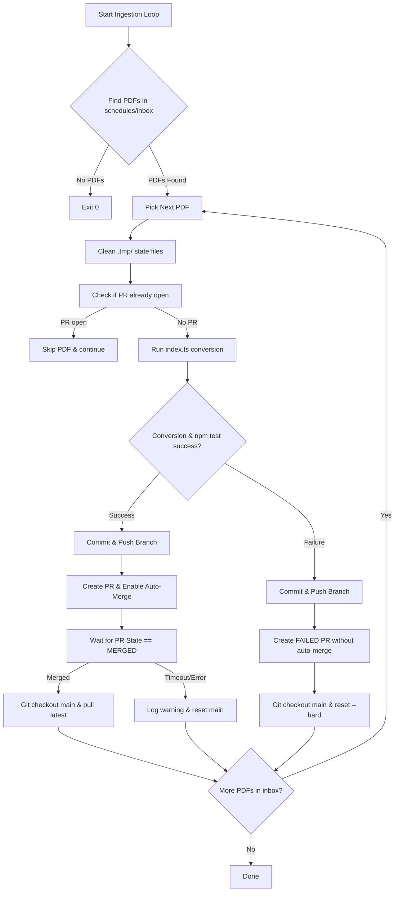

# Sequential PDF Ingestion Pipeline Design Spec

## Overview
The LairPages ingestion pipeline processes schedule PDFs dropped into `schedules/inbox/` and creates Pull Requests for each schedule. Previously, when multiple PDFs were present in a single batch, concurrent PRs updated `schedules/manifest.json` from the same base branch state (`main`), resulting in merge conflicts in `manifest.json` for subsequent PRs.

This design updates `.github/workflows/ingest-pdf.yml` to process PDFs sequentially with an automated merge-wait loop and non-blocking failure recovery.

## Requirements & Constraints
1. **Multi-File Batch Support**: The workflow must cleanly process multiple PDFs in `schedules/inbox/` in a single run without triggering git merge conflicts in `schedules/manifest.json`.
2. **Individual PRs**: Each PDF must still be processed in its own dedicated Pull Request.
3. **Non-Blocking Recovery**: If a PDF fails parsing or unit/validation tests, its PR will be created as `[FAILED]` (without auto-merge), and the workflow will immediately proceed to process the remaining PDFs without stalling or failing the entire batch.
4. **Clean State Isolation**: Untracked temporary files in `.tmp/` (`.tmp/processpdf_lastrun.json`, `.tmp/processpdf_summary.md`) must be cleaned at the start of each iteration to prevent state contamination between PDFs.
5. **Schema Preservation**: No changes to `schedules/manifest.json` structure or client API (`Lair`).

## Architecture & Workflow Flow



## Detailed Changes

### 1. Component: `.github/workflows/ingest-pdf.yml`

#### A. State Cleanup per Iteration
Before processing each file:
```bash
rm -f .tmp/processpdf_lastrun.json .tmp/processpdf_summary.md
```

#### B. Merge Wait Loop
For successful processing attempts where auto-merge is enabled:
- Execute `gh pr merge "$branch_name" --auto --merge --delete-branch`.
- Poll PR state via `gh pr view "$branch_name" --json state` every 5 seconds until `state == "MERGED"` or timeout (300 seconds).
- **If Merged**:
  ```bash
  git checkout main
  git fetch origin main
  git reset --hard origin/main
  ```
- **If Timeout or Closed without merge**:
  - Log warning with PR URL.
  - Reset working tree to `main` (`git checkout main && git reset --hard origin/main`).

#### C. Non-blocking Failure Recovery
For attempts where parsing or `npm test` fails:
- Execute `gh pr create --title "[FAILED] Auto-ingest schedule: $(basename "$file")" ...`.
- Do NOT enable auto-merge.
- Immediately clean up local working tree and sync to `main`:
  ```bash
  git checkout main
  git reset --hard origin/main
  ```
- Log diagnostic message and proceed to the next PDF in `files`.

### 2. Component: `.github/workflows/validate.yml`

#### Concurrency Group Adjustment
Split concurrency groups so PR status check runs do not cancel push-to-main deployment runs:
```yaml
concurrency:
  group: "validate-${{ github.event.pull_request.number || github.sha }}"
  cancel-in-progress: true
```

## Verification Plan

### Automated Testing
- Execute Vitest suite: `npm test`.

### Manual / Workflow Verification
- Validate workflow YAML syntax.
- Verify bash loop handles `MERGED`, `FAILED`, and timeout states cleanly.
